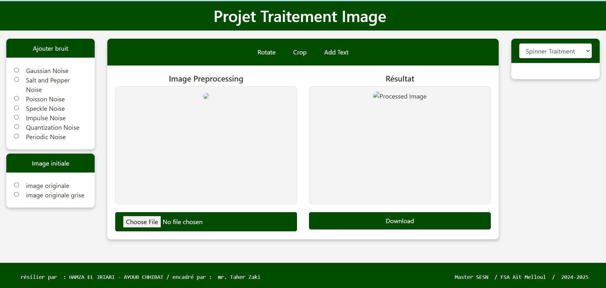
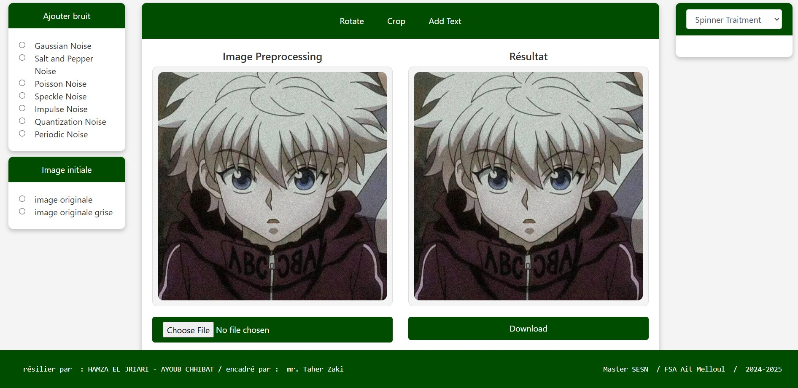
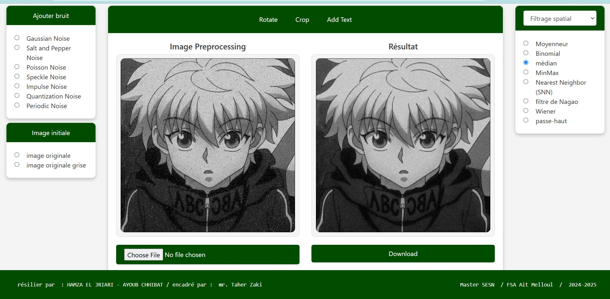
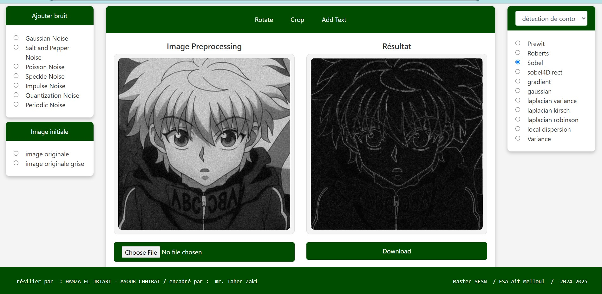

# Image Processing - Interactive Web Interface

## Project Description
This project aims to develop an interactive web platform that allows users to manipulate and explore images using various image processing techniques. The interface enables users to add noise to images, apply spatial and frequency filtering, detect edges, and perform morphological transformations, all while providing an intuitive and educational experience.

## Objectives
- **Add different types of noise to images**:
  - Gaussian noise
  - Salt-and-pepper noise
  - Poisson noise
  - Etc.

- **Apply filters for image processing**:
  - Spatial filtering
  - Frequency filtering

- **Detect edges and apply morphological transformations.**

- **Provide an interactive platform** to explore and visualize advanced image processing techniques in real-time.

## Technologies Used

### Frontend
- **HTML**: Structure of the web page.
- **CSS**: Styling and layout of the interface.
- **JavaScript**: Interaction and dynamic updating of UI elements.

### Backend
- **Django**: Python web framework to handle backend logic and image processing.

### Python Libraries
- **OpenCV**: Used for image processing and the implementation of algorithms like filtering, edge detection, etc.
- **NumPy**: Matrix manipulation for fast calculations on image data.

### Development Environment
- **Visual Studio Code**: Code editor used for project development.

## Features

### Filters Implemented (from scratch)

#### Spatial Filtering
- **Median Filter**: Reduces impulsive noise (salt-and-pepper).
- **High-Pass Filter**: Enhances edges and fine details.
- **Nagao Filter**: Adaptive smoothing while preserving edges.
- **Binomial Filter**: Smoothing while preserving details.

#### Frequency Filtering
- **Butterworth Filter**: Reduces high or low frequencies for low-pass or high-pass filtering.

#### Morphological Transformations
- **Erosion**: Reduces objects by removing border pixels.
- **Dilation**: Increases objects by adding pixels to the borders.
- **Opening**: Erosion followed by dilation to remove noise.
- **Closing**: Dilation followed by erosion to fill gaps in objects.

### Other Features
- **Add Noise**: Users can add Gaussian, salt-and-pepper, or Poisson noise to images.
- **Interactive Visualization**: The interface updates in real-time with each modification applied to the image.
- **Additional Image Processing**: Rotation, cropping, histogram adjustments, color inversion, binary thresholding.
- **Responsive Interface**: The interface adapts to all devices (desktops, tablets, and mobiles).


## TESTING

### 1. **Interface of the Application**

This is an image showcasing the user interface of the web application. It allows users to interact with the system, upload images, apply filters, and see the results in real-time.



### 2. **Uploading an Image**

In this image, we demonstrate how users can upload an image to the platform for processing. The application provides an easy-to-use interface for loading images, which can then be modified using various image processing techniques.



### 3. **Adding Noise to an Image**

Here, an example image is shown after noise has been added. This demonstrates the effect of noise (such as Gaussian noise, salt-and-pepper, etc.) on an image. The platform allows users to add different types of noise to explore their effects on image quality.



### 4. **Edge Detection Using Sobel Filter**

This image shows the result of applying the Sobel filter for edge detection. The Sobel filter is a commonly used edge detection operator that helps identify contours and boundaries in an image, highlighting the areas where significant changes in intensity occur.




## Installation

### Prerequisites
Ensure that Python 3.x is installed on your machine.

### Installation Steps

1. **Clone the repository**:
   ```bash
   git clone https://github.com/your-username/image-processing.git
   
2. **Navigate into the project directory:**
   ```bash
   cd image-processing
   
3. **Create a virtual environment (optional but recommended):**
   ```bash
   python -m venv venv
  
4. **Activate the virtual environment:**
   -On Windows: venv\Scripts\activate
   -On macOS/Linux: source venv/bin/activate

5. **Install dependencies: Install the required libraries by running:**
   ```bash
   pip install -r requirements.txt
   
   
6. **Apply database migrations: Run the following command to set up the database:**
   ```bash
      python manage.py migrate

7. **Run the Django development server: Start the server by running:**
   ```bash
   python manage.py runserver

8. **Access the application: Open your browser and go to http://127.0.0.1:8000/ to use the interactive web interface.**


